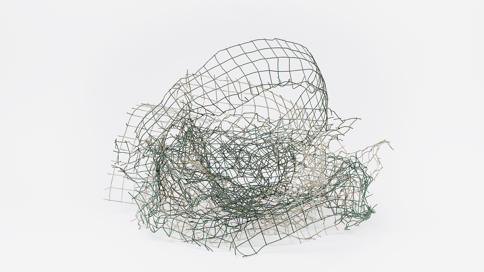

.. mbank documentation master file

Welcome to the documentation of mbank
=====================================

   This is a sculpture by `Gego <https://en.wikipedia.org/wiki/Gego>`_. With her work, she made  experiments on how to fill the infinite volume with lines, dots, grids and meshes. This is similar to what ``mbank`` does, even though we don't match the beauty and elegance of Gego's sculptures. Credits: `Guggenheim Foundation <https://www.guggenheim.org/exhibition/gego-measuring-infinity>`_

.. automodule:: mbank
   :members: 

.. toctree::
   :maxdepth: 2
   :caption: Usage
   :name: usage

   usage/install.md
   usage/overview.md
   usage/match.md
   usage/bank_generation.md
   usage/injections.md
   usage/metric.md
   usage/flow.md

.. toctree::
   :caption: Package reference
   :name: package_reference
   :maxdepth: 2
   
   package_reference/metric.rst
   package_reference/handlers.rst
   package_reference/bank.rst
   package_reference/placement.rst
   package_reference/utils.rst
   package_reference/parser.rst
   package_reference/mbankflow.rst

.. toctree::
   :caption: Executables
   :name: executables
   :maxdepth: 3

   package_reference/bin.rst

.. toctree::
   :maxdepth: 2
   :caption: About
   
   about.md
  
Indices and tables
==================

* :ref:`genindex`
* :ref:`modindex`
