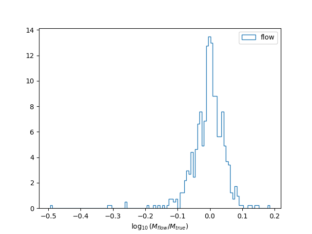
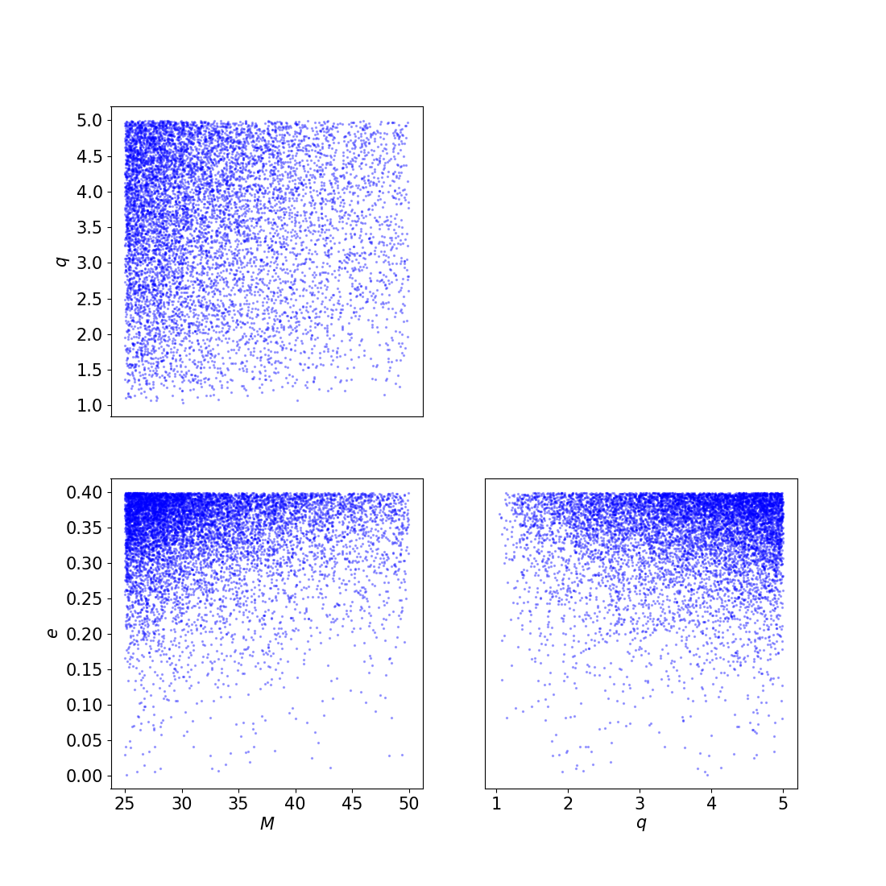
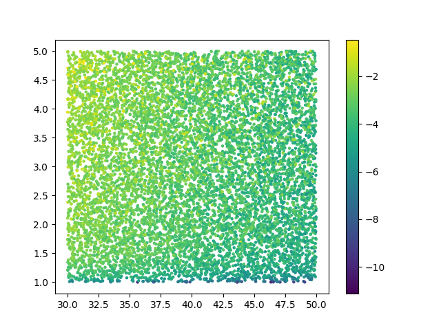
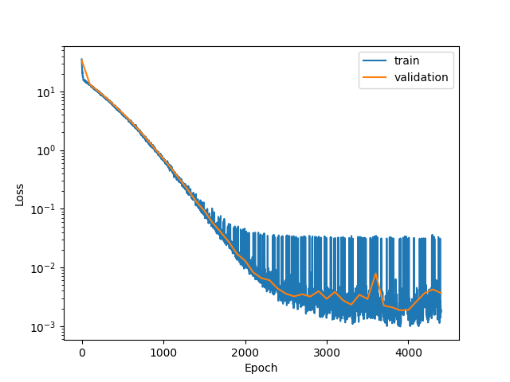
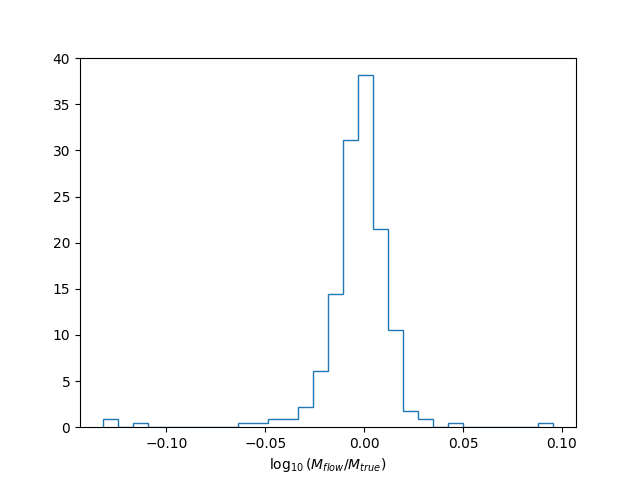
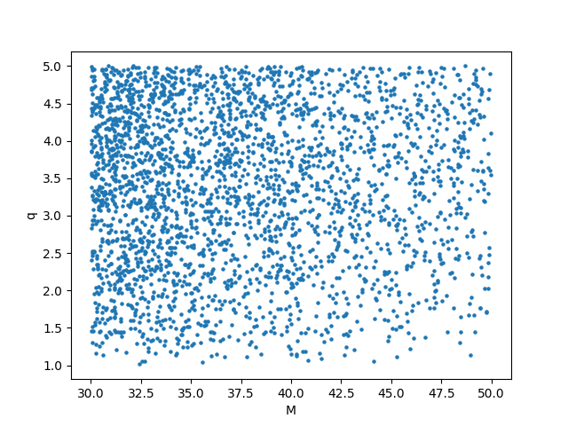
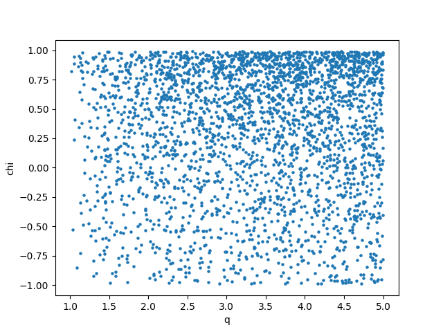

How to generate a bank
======================

The bank generation happens in three logical steps:

1. Dataset generation
2. Normalizing flow training 
3. Template placement

For the old version, which relies on the *tiling* for density estimation, you can refer to [this page](bank_generation_tiling.md). The page might be outdated and the template bank generated in this way will most likely be far from optimal.

## From command line

The good news is that if you want to generate a template bank, you don't have to write any new piece of code.
Indeed, to perform the three steps above there are three executables:

- ``mbank_generate_flow_dataset``: to generate a dataset for the normalizing flow dataset
- ``mbank_train_flow``: to use the previously generated dataset to train a normalizing flow model
- ``mbank_place_templates``: to use the normalizing flow to place template according to a given minimal match

Clearly, each take several options to control their behaviour. Some options are in common, while others are specific to the each command.

To know which options are available for each command, you can use the command line to run the command you're interested in with the `--help` option; for instance:

```Bash
mbank_place_templates --help
```

The output of the help of all the available commands is also accessible at [this](../package_reference/bin.rst) page.

### Gathering options on a `ini` file

It is convenient to gather all the relevant parameter in a single `ini` file. In this way, you type all your options in a single place and you make sure that different executables have access to the same options.

If you are dreaming of generating a template bank of [eccentric](https://en.wikipedia.org/wiki/Orbital_eccentricity) BBH signals, a `ini` file could look like this.

```ini
[my_first_eccentric_bank]

	#File settings
run-dir: eccentric_bank
dataset: dataset_eccentric.dat
flow-file: flow_eccentric.zip
bank-file: my_first_eccentric_bank.dat

	#Metric settings
variable-format: Mq_nonspinning_e
psd: ./aligo_O3actual_H1.txt
asd: true
metric-type: symphony
approximant: EccentricFD
f-min: 10
f-max: 1024
df: 0.5

	#Parameter space ranges
mtot-range: 25 50
q-range: 1 5
e-range: 0. 0.4

	#Dataset generation & flow training options
n-datapoints: 3000
n-layers: 2
hidden-features: 30
n-epochs: 100000
learning-rate: 0.005
patience: 20
min-delta: 1e-3
batch-size: 500
train-fraction: 0.8
load-flow: false
ignore-boundaries: false
only-ll: true

	#Placing method options
placing-method: random
n-livepoints: 1000
covering-fraction: 0.9
mm: 0.97

	#Injection generation options
gps-start: 1239641219
gps-end: 1239642219
time-step: 10
inj-out-file: eccentric_injections.xml

	#Injection options
n-injs: 500
inj-file: eccentric_injections.xml
full-symphony-match: true
metric-match: false

	#Communication with the user
plot: true
show: true
verbose: true
```

These are a lot of parameters. Without being exhaustive, we describe below the most important of them:

- `variable-format`: the coordinates to include in the bank. See [here](variable_handler) the available formats.
- `run-dir`: run directory. All the output will be stored here. Unless stated otherwise, all the inputs is understood to be located in this folder.
- `psd`: a psd file. If the option `asd` is set, the is understood to keep an ASD. The `ifo` option controls the interferometer to read the PSD of
- `mm`: minimum match requirement for the bank. It sets the average distance between templates
- `metric-type`: the metric computation algorithm to use. It is advised to use `symphony` for precessing and/or HM systems, while `hessian` for the others. Other options are possible, without being tested extensively.
- `placing-method`: the placing method to be used. While many are available (i.e. `stochastic` and `geometric`), only the `random` method has been extensively tested, as discussed in the publication.
- `livepoints`: the number of livepoints to be used for the random placing methods. This is the number of points that cover the space initially. They will be removed as soon as the bank grows in size.
- `covering-fraction`: the fraction of the space to be covered before stopping the template bank generation. The covering fraction is computed with a monte carlo estimation using the livepoints.
- `learning-rate`: learning rate for the training loop
- `min-delta` and `patience`: parameters to control the early stopping
- `approximant`: the lal waveform approximant to use for the metric computation
- `f-min`, `f-max`: the start and end frequency for the match (and metric) computation
- `var-range`: sets the boundaries for the variable `var`.
The possible variables are: `mtot`, `q`, `s1`/`s2`, `theta` (polar angle of spins), `phi` (azimuthal angle of spins), `iota` (inclination), `ref-phase` (reference phase), `e` (eccentricity), `meanano` (mean periastron anomaly).
- `n-layers`: number of layers to be used in the flow architecture. Each layer is formed by a Linear layer + a Masked Affine Autoregressive layer
- `hidden-features`: number of hidden features in each Masked Affine Autoregressive layer
- `n-epochs`: the number of training epochs for the flow
- `plot`: create the plots?
- `show`: show the plots?

Besides those parameters, we included a few parameters which are relevant for an injection study. Please, read more in the [next section](injections.md).

You can easily run by yourselfs all the commands below and in ten minutes, you will have a nice template bank.

```bash
mbank_generate_flow_dataset my_first_eccentric_bank.ini
mbank_train_flow my_first_eccentric_bank.ini
mbank_place_templates my_first_eccentric_bank.ini
```

They will produce a lots of plots, to validate your normalizing flow performance and to show the template distribution within the bank.
This is the accuracy of the normalizing flow to reproduce the true density {math}`\sqrt{M(\theta)}` of the parameter space with its PDF {math}`p_\text{flow}(\theta)`.



Finally, you can also see the resulting template bank.



You can find the [ini file](https://github.com/stefanoschmidt1995/mbank/blob/master/examples/my_first_eccentric_bank.ini) and all the plots produced by the code in the [example folder](https://github.com/stefanoschmidt1995/mbank/tree/master/examples) of the repository.

### Launching commands with condor

Sometimes it is convenient to run your bank generation job with condor. To generate a minimal condor submit file, you can add to any the executables abve the option `--make-sub`. This will create a `.sub` file which you can use to launch your `mbank` job.

For instance, to train the normalizing flow model with condor:

```Bash
mbank_train_flow --make-sub my_first_eccentric_bank.ini
condor_submit eccentric_bank/mbank_train_flow_my_first_eccentric_bank.sub
```

And similarly for the other commands.

Here's how the submit file looks like:

```
Universe = vanilla
batch_name = mbank_train_flow_my_first_eccentric_bank
Executable = /usr/bin/mbank_train_flow
arguments = "my_first_eccentric_bank.ini"
getenv = true
Log = eccentric_bank/_mbank_train_flow_my_first_eccentric_bank.log
Error = eccentric_bank/_mbank_train_flow_my_first_eccentric_bank.err
Output = eccentric_bank/_mbank_train_flow_my_first_eccentric_bank.out
request_memory = 4GB
request_disk = 4GB
request_cpus = 1

queue
```

## Bank by hands

Of course you can also code the bank generation by yourself in a python script.
Althought this requires more work, it gives more control on the low level details and in some situation can be useful. However, for ease of use, it is always advised to use the provided executables,  `mbank_generate_flow_dataset`,  `mbank_train_flow` and `mbank_place_templates`.

The code executed below is also available in the example folder of the repository: check out [bank_by_hand.py](https://github.com/stefanoschmidt1995/mbank/blob/master/examples/bank_by_hand.py).

### Initialization

First things first, the imports:

```Python
from mbank import variable_handler, cbc_metric, cbc_bank
from mbank.utils import load_PSD, plot_tiles_templates, get_boundaries_from_ranges
from mbank.placement import place_random_flow
from mbank.flow import STD_GW_Flow
from mbank.flow.utils import early_stopper, plot_loss_functions
from tqdm import tqdm
from torch import optim
import numpy as np
import matplotlib.pyplot as plt
```

In this simple tutorial, we will generate a three dimensional bank (`D=3`) sampling the variables {math}`M, q, \chi_{eff}`.
You will need to set the appropriate `variable_format`: it is a string that encodes the variables being used. The variable format is internally managed by a class {class}`mbank.handlers.variable_handler`.
We also specify the boundaries of the template bank, encoded as `(2,D)` array where the rows keeps the upper/lower limits.


```Python
variable_format = 'Mq_chi'
boundaries = np.array([[30,1,-0.99],[50,5,0.99]])
	#Another option using get_boundaries_from_ranges
boundaries = get_boundaries_from_ranges(variable_format,
		(30, 50), (1, 5), chi_range = (-0.99, 0.99))
```

The next step is to create a metric object, implemented in the class {class}`mbank.metric.cbc_metric`. This will take care of generating the metric given a point in space and a PSD.
Your favourite PSD is provided by the LIGO-Virgo collaboration and can be downloaded [here](https://dcc.ligo.org/LIGO-T2000012/public).
For initialization, you need to specify also the approximant and the frequency range (in Hz) for the metric.

```Python
metric = cbc_metric(variable_format,
			PSD = load_PSD('aligo_O3actual_H1.txt', True, 'H1'),
			approx = 'IMRPhenomD',
			f_min = 10, f_max = 1024)
```

### Dataset generation

We are now ready for the bank generation. As said above (many many times), this is done in three steps.
First, lets generate a flow dataset (split of course between train and validation):

```Python
train_data = np.random.uniform(*boundaries, (10000, 3))
validation_data = np.random.uniform(*boundaries, (300, 3))
train_ll = np.array([metric.log_pdf(s) for s in tqdm(train_data)])
validation_ll = np.array([metric.log_pdf(s) for s in tqdm(validation_data)])
```

This may take a few minutes...

### Flow training

We can now instantiate and train (and test) a normalizing flow model:

```Python
flow = STD_GW_Flow(3, n_layers = 2, hidden_features = 30)

early_stopper_callback = early_stopper(patience=20, min_delta=1e-3)
optimizer = optim.Adam(flow.parameters(), lr=5e-3)
scheduler = optim.lr_scheduler.ReduceLROnPlateau(optimizer, 'min', threshold = .02, factor = 0.5, patience = 4)
	
history = flow.train_flow('ll_mse', N_epochs = 10000,
	train_data = train_data, train_weights = train_ll,
	validation_data = validation_data, validation_weights = validation_ll,
	optimizer = optimizer, batch_size = 500, validation_step = 100,
	callback = early_stopper_callback, lr_scheduler = scheduler,
	boundaries = boundaries, verbose = True)

residuals = np.squeeze(validation_ll) - flow.log_volume_element(validation_data)
```

The last line computes the discrepancy between the true (log) volume element and the flow estimate. We also implemented early stopping and learning rate decay, to make sure we obtain an optimally trained network.

As described in the paper, we don't have access from samples of the parameter space. For this reason, we use a modified loss function `ll_mse`, which treats the training as a regression problem rather than a density estimation problem.
Of course, if you had samples, you could also train the flow in the standard way, employing the `forward_KL` loss function

### Bank generation

Now, we come to the third step, where we place the templates using the random method. The templates are gathered in a {class}`mbank.bank.cbc_bank` object, which represents a template bank. A bank can be saved, loaded and the bank object offers some functionalities to easily access the templates.

```Python
new_templates = place_random_flow(0.97, flow, metric,
	n_livepoints = 500, covering_fraction = 0.9,
	boundaries_checker = boundaries,
	metric_type = 'symphony', verbose = True)
bank = cbc_bank(variable_format)
bank.add_templates(new_templates)
```

You can save the flow and the template bank with:

```Python
flow.save_weigths('flow.zip')
bank.save_bank('bank.dat')
```

### Plotting

Finally, you can generate some nice plots to check that everything makes sense. You can plot the training data:

```Python
plt.figure()
plt.scatter(train_data[:,0], train_data[:,1], c = train_ll, s = 5)
plt.colorbar()
```



You can display the loss function and the histogram of the accuracy of the normalizing flow model

```Python
plot_loss_functions(history)

plt.figure()
plt.hist(residuals/np.log(10),
	histtype = 'step', bins = 30, density = True)
plt.xlabel(r"$\log_{10}(M_{flow}/M_{true})$")
```





Finally, you can plot the templates in two 2D scatter plots:

```Python
plt.figure()
plt.scatter(bank.M, bank.q, s = 5)
plt.xlabel('M')
plt.ylabel('q')

plt.figure()
plt.scatter(bank.q, bank.chi, s = 5)
plt.xlabel('q')
plt.ylabel('chi')
```





