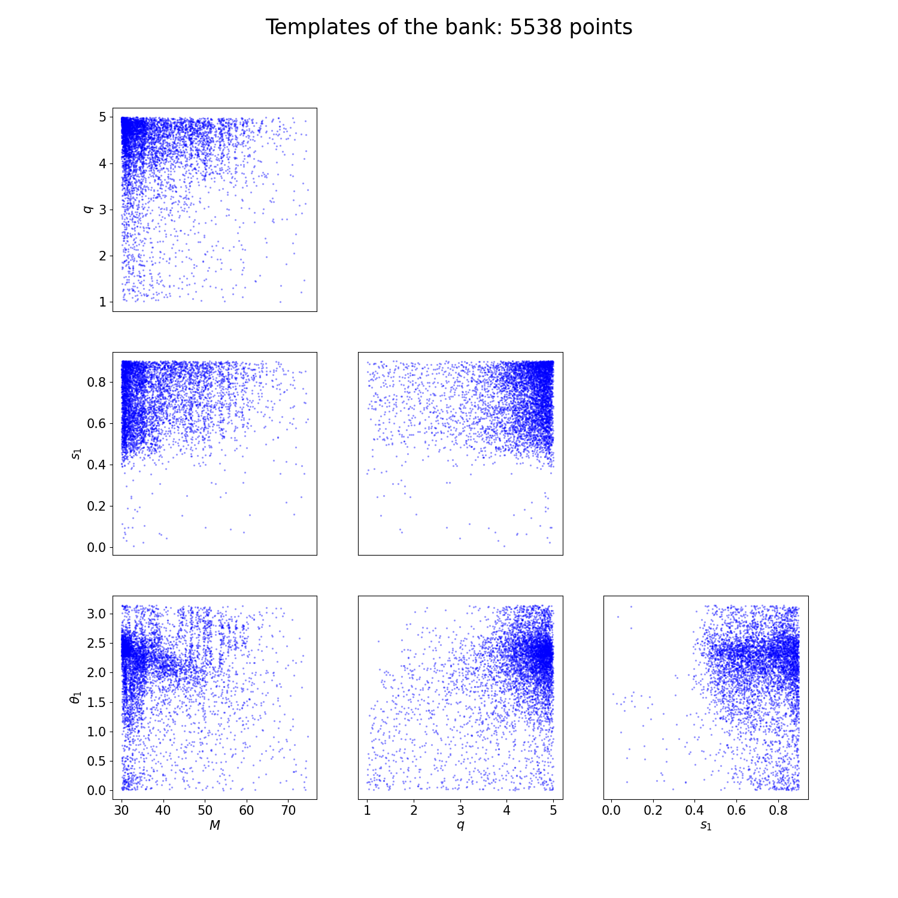
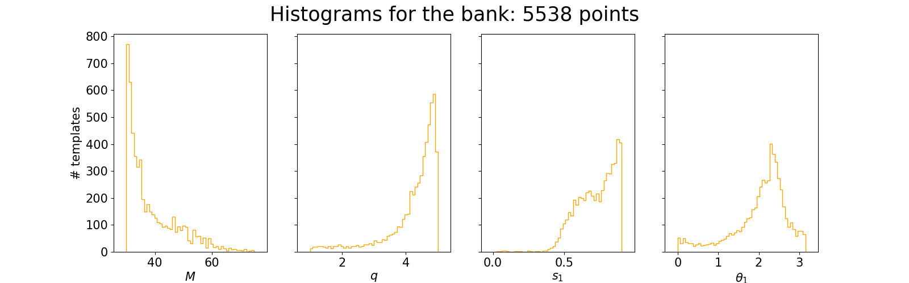

Deprecated bank generation
==========================

The following instruction will still work (with a probability of 90%) but you are not recommended to use them. Indeeed, they refer to an old version of the paper and the methods described here has some know issues. We keep the old doc page, just in case.

To generate a bank, you need to specify some of the following options to the command `mbank_run`:

- `run-name`: a label for the run. All the output files will be named accordingly.
- `variable-format`: the coordinates to include in the bank. See [here](variable_handler) the available formats.
- `mm`: minimum match requirement for the bank. It sets the average distance between templates
- `run-dir`: run directory. All the output will be stored here. Unless stated otherwise, all the inputs is understood to be located in this folder.
- `psd`: a psd file. If the option `asd` is set, the is understood to keep an ASD. The `ifo` option controls the interferometer to read the PSD of
- `placing-method`: the placing method to be used
- `livepoints`: the number of livepoints to be used for the random placing methods. This is the number of points that cover the space initially. They will be removed as soon as the bank grows in size. They are expressed as a factor with respect to the number of template placed by the naive uniform method.
- `empty-iterations`: in the context of stochastic placement, it is the number of rejected proposal inside each tile before no more proposal will be done in that tile.
- `grid-size`: set the size of the first coarse division along each variable. If the `use-ray` option is set, each coarse division will run in parallel
- `tile-tolerance`: a parameter to control when the iterative splitting of a tile will end. The iteration stops if `0.5*log_10(|M1|/|M2|)<tile-tolerance`, where `M1` and `M2` is the metric of the two children generated by splitting a tile
- `max-depth`: maximum number of split before the iterative splitting process is terminated.
- `approximant`: the lal waveform approximant to use for the metric computation
- `f-min`, `f-max`: the start and end frequency for the match (and metric) computation
- `var-range`: sets the boundaries for the variable `var`.
The possible variables are: `mtot`, `q`, `s1`/`s2`, `theta` (polar angle of spins), `phi` (azimuthal angle of spins), `iota` (inclination), `ref-phase` (reference phase), `e` (eccentricity), `meanano` (mean periastron anomaly).
- `plot`: create the plots?
- `show`: show the plots?
- `use-ray`: whether to parallelize the metric computation using the [`ray` package](https://www.ray.io/)
- `train-flow`: whether to train a normalizing flow model to interpolate within the tiles. The flow will be trained with samples from the tiling and used to interpolate between them
- `n-layers`: number of layers to be used in the flow architecture. Each layer is formed by a Linear layer + a Masked Affine Autoregressive layer
- `hidden-features`: number of hidden features in each Masked Affine Autoregressive layer
-`n-epochs`: the number of training epochs for the flow


The bank will be saved in folder `run-dir` under the name `bank_run_name`, both in `dat` and `xml` format. The tiling will be saved under the name `tiling_run_name.npy`. If the flow model is employed, a file `flow_run_name.zip` will gather the weights of the trained flow.

`mbank_run` will execute the following steps:
- instantiate the metric
- generate the tiling
- train the normalizing flow model (optional)
- place the templates with the desired method

Another command, `mbank_place_templates` performs only the template placement, given a tiling (option `--tiling-file`). It can also load and use a pre-trained normalizing flow model (option `--flow-file`). If the option `--train-flow` is enabled, the flow generation will be performed.

## Bank from command line

If you want to generate your first precessing bank, the options can be packed into a nice [`my_first_precessing_bank.ini`](https://github.com/stefanoschmidt1995/mbank/tree/master/examples/my_first_precessing_bank.ini) file like this:

```ini
[my_first_precessing_bank]

	#General options
variable-format: Mq_s1xz
mm: 0.97
run-dir: precessing_bank

	#PSD options
psd: ./aligo_O3actual_H1.txt
ifo: H1
asd: true

	#Placing method options
placing-method: stochastic
n-livepoints: 20000
empty-iterations: 100

	#Tiling options
grid-size: 1,1,2,2
tile-tolerance: 0.3
max-depth: 10
mtot-range: 30 75
q-range: 1 5
s1-range: 0.0 0.9 
theta-range: -0.0 3.15

	#Metric options
approximant: IMRPhenomXP
f-min: 15
f-max: 1024

	#Flow options
train-flow: true
n-layers: 4
hidden-features: 4
n-epochs: 2000

	#Other options
plot: true
show: true
use-ray: true
```

The `[section]` specification is compulsory: this will set the `run-name` variable!
You can then create your first precessing bank by

```Bash
mbank_run my_first_precessing_bank.ini
```

If the `--plot` option is set, you will see in your `--run-dir` two plots describing your bank:





And another one describing the normalizing flow model:


If you are happy with your tiling but you want to run again the template placing, you can run the command `mbank_place_templates`. Do not forget to specify the name of a tiling file!
For instance, if you want to change the minimum match, you can simply run:
	
```Bash
mbank_place_templates --tiling-file tiling_my_first_precessing_bank.npy --mm 0.95 my_first_precessing_bank.ini
```

This will do the template placing again and will produce a new bank and plots.

### Launching `mbank_run` with condor

Sometimes it is convenient to run your bank generation job with condor. To generate a minimal condor submit file, you can add the option `--make-sub-file`: it will create a `.sub` file which you can use to launch your `mbank_run` job.

```Bash
mbank_run --make-sub-file my_first_precessing_bank.ini
condor_submit precessing_bank/mbank_run_my_first_precessing_bank.sub
```

Here's how the submit file looks like:

```
Universe   = vanilla
Executable = /usr/bin/mbank_run
arguments = "my_first_precessing_bank.ini"
getenv = true
Log = precessing_bank/mbank_run_my_first_precessing_bank.log
Error = precessing_bank/mbank_run_my_first_precessing_bank.err
Output = precessing_bank/mbank_run_my_first_precessing_bank.out
request_memory = 4GB
request_cpus = 4
request_disk = 4GB

queue
```

## Bank by hands

Of course you can also code the bank generation by yourself in a python script. Althought this requires more work, it gives more control on the low level details and in some situation can be useful. However, for ease of use, it is always advised to use the provided executables `mbank_run` and `mbank_place_templates`.

First things first, the imports:

```Python
from mbank import variable_handler, tiling_handler, cbc_metric, cbc_bank
from mbank.utils import load_PSD, plot_tiles_templates, get_boundaries_from_ranges
import numpy as np
```

In this simple tutorial, we will generate a three dimensional bank (`D=3`) sampling the variables `M,q, chi`.
You will need to set the appropriate `variable_format`: it is a string that encodes the variables being used. The variable format is taken care of by a class `variable_handler`: see the class reference for more information.
We also instantiate a bank object `bank`, which will handle the templates and the template placing.

```Python
variable_format = 'Mq_chi'
var_handler = variable_handler()
bank = cbc_bank(variable_format)
```

Before filling the banks, we need to build:

- The boundaries of the space
- The metric

The boundaries of the banks are encoded as `(2,D)` numpy array where the rows keeps the upper/lower limits.

```Python
boundaries = np.array([[20,1,-0.99],[40,5,0.99]])
	#Another option using get_boundaries_from_ranges
boundaries = get_boundaries_from_ranges(variable_format,
		(20, 40), (1, 5), chi_range = (-0.99, 0.99))
```

The next step is to create a metric object. This will take care of generating the metric given a point in space and a PSD.
Your favourite PSD is provided by the LIGO-Virgo collaboration and can be downloaded [here](https://dcc.ligo.org/LIGO-T2000012/public).
For initialization, you need to specify also the approximant and the frequency range (in Hz) for the metric.

```Python
metric = cbc_metric(variable_format,
			PSD = load_PSD('aligo_O3actual_H1.txt', True, 'H1'),
			approx = 'IMRPhenomD',
			f_min = 10, f_max = 1024)
```

We are now ready for the bank generation. This is done with:

```Python
t_obj = bank.generate_bank(metric, minimum_match = 0.97, boundaries = boundaries,
		tolerance = 0.3, max_depth = 10,
		placing_method = 'random', metric_type = 'hessian', grid_list = (1,1,4),
		N_livepoints = 20000, empty_iterations = 100,
		use_ray = True)
```

Running this may take a while...
The function returns a `tiling_handler` object which gathers the tiling. The tiling is independent from the bank, hence coded in a different object.
The template of the bank are saved like a `(N,3)` numpy array under the name `bank.templates`.

You can save the tiling and the bank with:

```Python
t_obj.save('tiling.npy')
bank.save_bank('bank.dat')
```

As mentioned above, the bank generation happens in two steps: tiling generation (plus eventual flow training) and template placement. If you want even more control on the low level details, you can perform these two operations separately.

To generate a tiling:

```Python
t_obj = tiling_handler()
metric_function = lambda center: metric.get_metric(center)
t_obj.create_tiling_from_list(boundaries, tolerance = 0.3, max_depth = 10,
		metric_func = metric_function)
```

You can also train (and save) the normalizing flow model, given the tiling:

```Python
t_obj.train_flow(N_epochs=1000, N_train_data=10000, n_layers=2, hidden_features=4, verbose = True)
t_obj.flow.save_weigths('flow.zip')
```

Given a tiling, you can generate a bank with:
```Python
bank.place_templates(t_obj, 0.97, placing_method = 'random',
		N_livepoints = 20, empty_iterations = 100)
```
If the tiling has a flow attached, the flow will be used to interpolate the metric and place the templates.

Finally, you can generate some nice plots of the bank + tiling by calling the function `plot_tiles_templates`:

```Python
plot_tiles_templates(bank.templates, variable_format, t_obj, show = True)
```


