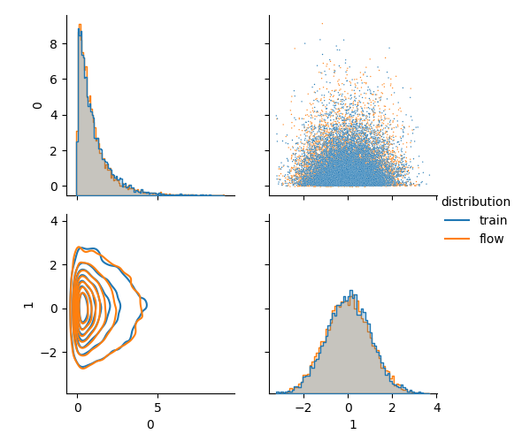
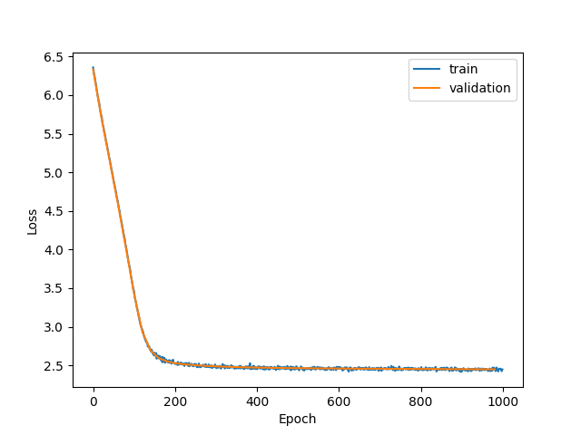
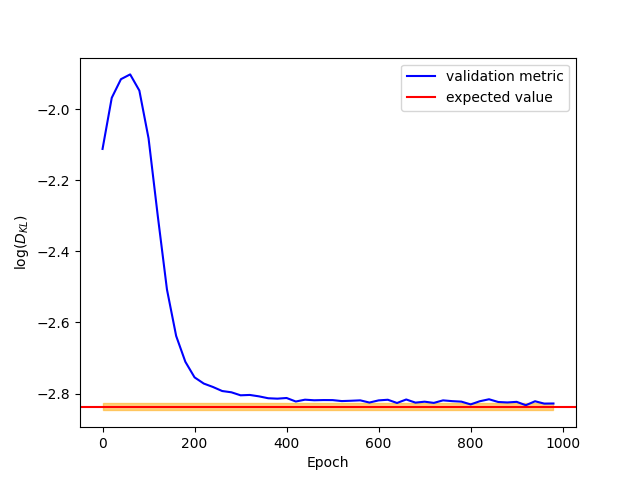

Working with normalizing flows
==============================

A [normalizing flow](https://arxiv.org/abs/1912.02762) is a powerful Machine Learning model which allow to sample from a complicated distribution in an analytical way. Since the template placing can be cast into a sampling (+ rejection) problem, it is natural to use such model to improve the performance of the metric placement.
In this context, the flow acts both as a sampling model and metric interpolator, with great improvement in template placement performance.
Inside `mbank`, a normalizing flow model is attached to the tiling and it's a black box: the user does not need to go into the details of it.

Here we want to do more and train a normalizing flow model to reproduce a generic target distribution: this will give us the chance to learn about the low levels details of the module `mbank.flow`.

## General information

A normalizing flow is a invertible transformation that maps the data into an abstract space. The flow is trained in such a way that the transformation maps the empirical distribution of the data to a gaussian normal distribution.
In this respect, a normalizing flow encodes also a probability distribution on the space of data.

The mapping is usually implemented as a stack of ''simple" transformations, which if trained properly are able to model any complex distrbution.
The training is performed by minizing the forward KL distance between the probability distribution defined by the data and the one defined by the normalizing flow model.

## Let's get our hands dirty

Our code heavily relies on [`nflows`](); unfortunately, the code is no longer maintened and for this reason we are using the package `glasflow` which maintains a fork to the original code (plus some new additional features).

First thing first, we need to generate our training data from a complicated distribution:

```Python
import numpy as np
N_samples = 100_000
data = np.column_stack([np.random.exponential(1., N_samples), np.random.normal(0,1,N_samples)])
```

Next we are going to define a normalizing flow model. We will define a base distribution and a list of transformation, using the `nflows` fashion.
We are very free to decide the type of transformations we wish. Her, however, we will limit ourselfs to a set of identical layers, similarly to what implemented in `mbank`. Each layer will be composed by a (invertible) linaer transformation and of a [Masked Autoregressive Layer](). The latter is a complicated non-linear relation between the inputs and the outpus; internally it uses a number of hidden features, which is a free parameter that can be tuned by the user.
We will consider a flow with 3 layers and 5 hidden features.

```Python
from glasflow.nflows.distributions.normal import StandardNormal
from glasflow.nflows.transforms.autoregressive import MaskedAffineAutoregressiveTransform
from glasflow.nflows.transforms.linear import NaiveLinear
from glasflow.nflows.transforms.base import CompositeTransform
from mbank.flow import TanhTransform

D = 2 # dimensionality of the distribution

base_dist = StandardNormal(shape=[D])
		
transform_list = [TanhTransform(D)]

for _ in range(3):
	transform_list.append(NaiveLinear(features=D))
	transform_list.append(MaskedAffineAutoregressiveTransform(features=D, hidden_features=5))

transform_list = CompositeTransform(transform_list)
```

You may have noted that the first tranformation [`TanhTransform`](../package_reference/mbankflow.rst#mbank.flow.flowmodel.TanhTransform) is different from the others. It implements a iperbolic tangent transformations, which maps a rectangle into the whole D-dimensional space. It is very useful (actually recommended) to introduce such transformation whenever the target data distribution has a compact support. In this way, the data are mapped to the whole space R^D and become unbounded, resulting much easier to learn from a gaussian. The size of the rectangle is of course a learnable parameter that will be set during the training.

We can now initialize a `GW_Flow` object using the base distribution and the transformation we defined:

```Python
from mbank.flow import GW_Flow

flow = GW_Flow(transform=transform_list, distribution=base_dist)
```

If all of this seems tedious, you're right: you can obtain the same result using the class `STD_GW_Flow`:

```Python
from mbank.flow import STD_GW_Flow

flow = STD_GW_Flow(D, n_layers = 3, hidden_features = 5)
```
The class inherith from `GW_Flow` and adds useful I/O to save the weights to file and load them by inferrring authomatically the architecture.


We are now ready for the training:

```Python
from torch import optim
optimizer = optim.Adam(flow.parameters(), lr=0.001)

	#Splitting training and validation
train_data, validation_data = data[:90_000], data[90_000:]

history = flow.train_flow_forward_KL(N_epochs = 1000, train_data = train_data, validation_data = validation_data,
	optimizer = optimizer, batch_size = 10000, validation_step = 20, verbose = True)	
```

The training will take a while, but no worries: if you get bored you can quit the training by pressing CTR+C.
The training will update iteratively the weights of the flow and will return a history dictionary with useful information about the loss function and the validation metric (the KL divergence between the PDF of data and the PDF of flow).

Once the flow is trained, you can sample from it or evaluate the (log)probability distribution function:

```Python
	#Drawing 1000 samples
samples = flow.sample(1000)

	#Evaluating the PDF over that samples
log_pdf = flow.log_prob(samples)
```

You can also transform then to the noise space, using the inverse flow transformation. In this case, the samples in the noise space will be gaussian distributed.

```Python
	#Mapping the samples to the noise space
noise_samples = flow.transform_to_noise(samples)
```

`mbank.flow` provides an handy module to take care of the plotting of the history and of the probability distribution both of the flow and data. You will then be able to assess, at a glance, the performance of the model.

```Python
from mbank.flow.utils import plot_loss_functions, compare_probability_distribution
plot_loss_functions(history)
compare_probability_distribution(flow.sample(10000).detach().numpy(), validation_data, show = True)
```

Here's the comparison between the two probability distributions:



Here's the loss function together with the validation metric:






