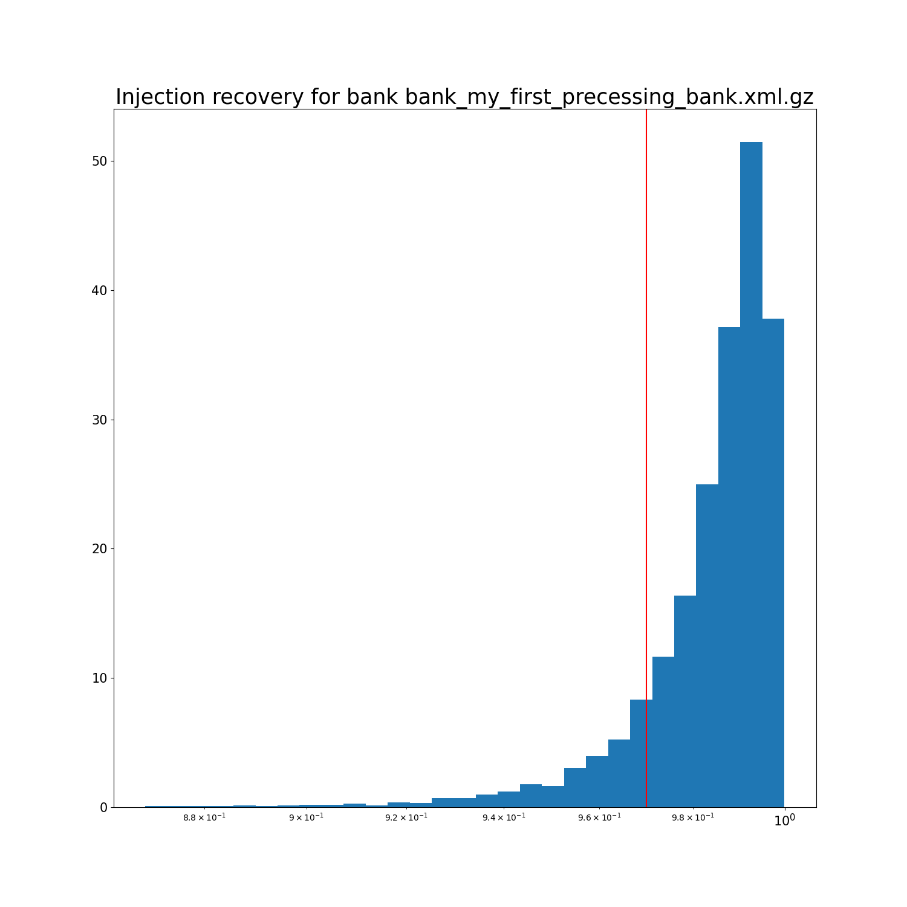
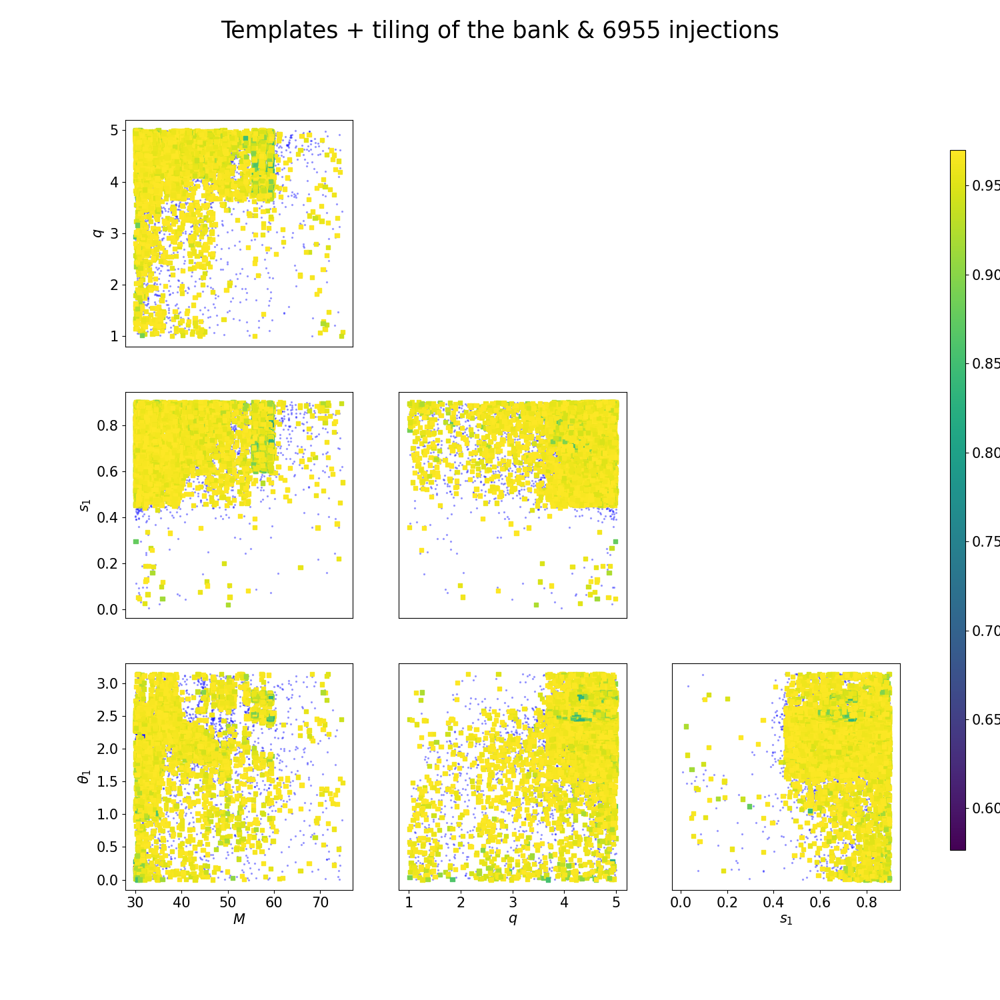

How to perform injections
=========================

The injection code throws injections in the bank and computes the match of each of them with the templates. The injections can be either loaded by file either randomly generated within each tile.

Many options are in common with `mbank_place_templates`. The options unique to the `mbank_injections` are:

- `bank-file`: name of the bank file
- `inj-file`: an xml file to load a generic set of injection from. It can be generated with `mbank_injfile`, which can draw injections from a given normalizing flow model.
- `n-injs`: how many injections to perform? They will randomly placed in the space so that each tile will keep a number of injections proportional to the volume.
- `full-match`: whether to compute the full match, rather than just the metric approximation
- `mchirp-window`: relative chirp mass window. For each injection, we compute the match only with the templates with a relative difference in chirp mass less than `mchirp-window`.

## Injections from command line
Assuming you generated the bank normally in the [previous section](bank_generation.md), you can use the same [ini file](https://github.com/stefanoschmidt1995/mbank/blob/master/examples/my_first_eccentric_bank.ini) to generate the injection file and to perform the injection study.

By running

```Bash
mbank_injfile my_first_precessing_injections.ini
mbank_injections my_first_precessing_injections.ini
```

This will produce two nice plots.

The histogram of the fitting factor of each injection (i.e. best match of an injection with the templates)



and a scatter plot with the injections with fitting factor smaller that `mm`: 


As you see very very few injections have fitting factor below 0.97, which means that the bank is doing a good job at covering the space.

## Injections by hands

Again, we can also perform injections using a python script (although this is not advised).
Here we assume we have at hand a three dimensional bank `bank.dat` and a flow `flow.zip`, with the variable format `Mq_chi`: this was generated in the previous [page](../usage/bank_generation.md).

CHECKME!!!!!

After the imports,

```Python
from mbank import variable_handler, cbc_metric, cbc_bank, tiling_handler
from mbank.utils import compute_injections_match, compute_injections_metric_match
from mbank.utils import load_PSD, plot_tiles_templates
import numpy as np
```

you need to load the bank, the tiling and the (optional) flow:

```Python
bank = cbc_bank('Mq_chi', 'bank.dat')
t_obj = tiling_handler('tiling.npy')
t_obj.load_flow('flow.zip') #optional step
```
We then generate the injection sampling them from the tiling and compute the match with the bank:

```Python
n_injs = 1000
injs_3D = t_obj.sample_from_tiling(n_injs)
stat_dict = compute_injections_metric_match(injs_3D, bank, t_obj)
```
The function will return a dictionary with the injections statistics computed: note that since we are using the metric approximation to the match, it runs very fast. To know more about the entries of the dictionary, you can take a look at the documentation of `mbank.utils.compute_metric_injections_match`.
The output dictionary also keeps the value of the injections in the full 12 dimensional BBH space, so that you don't need to worry to save them separately.

If you want to compute the full match, you can do so, after the computation of the _metric_ match, with the function `compute_injections_match`. Make sure to define a metric object first and transform your templates in the full 12 dimensional BBH space!

```Python
metric = cbc_metric(bank.variable_format,
			PSD = load_PSD('aligo_O3actual_H1.txt', True, 'H1'),
			approx = 'IMRPhenomD',
			f_min = 10, f_max = 1024)
templates_full = np.array(variable_handler().get_BBH_components(bank.templates, bank.variable_format)).T
stat_dict = compute_injections_match(stat_dict, templates_full, metric,
			mchirp_window = 0.1, symphony_match = False, cache = False)
```
This will update some of the entries of the `stat_dict` with the unapproximated fitting factors: as the generation of many WFs is required, this will take a while.

We can then plot the injections performed on the tiling and we colour them by their fitting factor:

```Python
best_matches = stat_dict['match'] if stat_dict['match'] is not None else stat_dict['metric_match']
plot_tiles_templates(bank.templates, bank.variable_format, t_obj,
			injections = injs_3D, show = True,
			inj_cmap =  best_matches)
```


