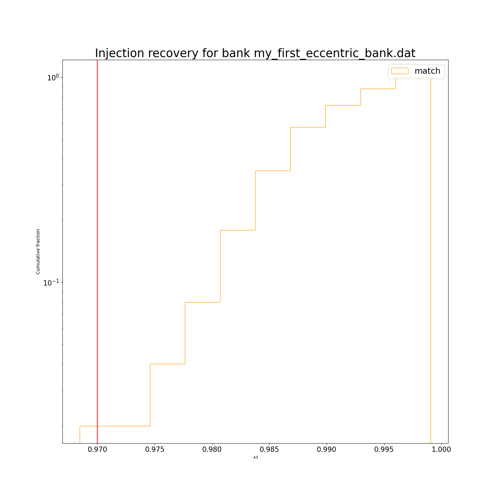

How to perform injections
=========================

The injection code throws injections in the bank and computes the match of each of them with the templates. The injections can be either loaded by file either randomly generated within each tile.

Many options are in common with `mbank_run` and `mbank_place_templates`. The options unique to the `mbank_injections` are:

- `tiling-file`: name of the tiling file
- `bank-file`: name of the bank file
- `inj-file`: an xml file to load a generic set of injection from. If it's not set, the injections will be drawn inside the tiles.
- `injs-per-tile`: how many injections in each tile? If `inj-file` is set, this option is ignored
- `seed`: random seed for the injections
- `full-match`: whether to compute the full match, rather than just the metric approximation
- `N-neigh-templates`: number of neighbours template (in euclidean distance) to compute the metric match with
- `N-neigh-templates-full`: number of neighbours template (in metric distance) to compute the full match with.


## Executing the command
Assuming you generated the bank normally, here's how an injection file [`my_first_precessing_injections.ini`](https://github.com/stefanoschmidt1995/mbank/tree/master/examples/my_first_precessing_injections.ini) could look like (but you're suggested to keep all the options in a single file):

```ini
[my_first_precessing_bank]
variable-format: Mq_s1xz
mm: 0.97
run-dir: precessing_bank
psd: ./H1L1-REFERENCE_PSD-1164556817-1187740818.xml.gz
ifo: L1
asd: false
approximant: IMRPhenomPv2
f-min: 10
f-max: 1024
plot: true
show: true
use-ray: true

tiling-file: tiling_my_first_precessing_bank.npy
bank-file: bank_my_first_precessing_bank.xml.gz

injs-per-tile: 40
seed: 0
N-neigh-templates: 1000
N-neigh-templates-full: 80 
full-match: false
```

By running

	mbank_injections my_first_precessing_injections.ini

This will produce two nice plots:



## Doing injections by hand
