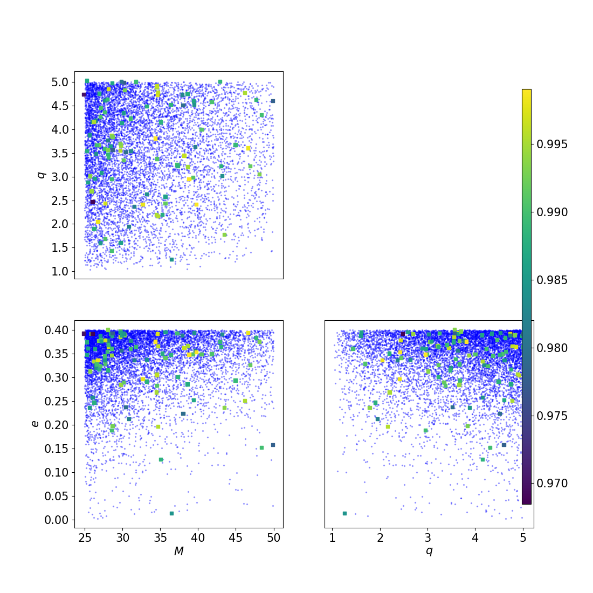

How to perform injections
=========================

The injection code throws injections in the bank and computes the match of each of them with the templates. The injections can be either loaded by file either randomly generated within each tile.

Many options are in common with `mbank_place_templates`. The options unique to the `mbank_injections` are:

- `bank-file`: name of the bank file
- `inj-file`: an xml file to load a generic set of injection from. It can be generated with `mbank_injfile`, which can draw injections from a given normalizing flow model.
- `n-injs`: how many injections to perform? They will randomly placed in the space so that each tile will keep a number of injections proportional to the volume.
- `full-match`: whether to compute the full match, rather than just the metric approximation
- `mchirp-window`: relative chirp mass window. For each injection, we compute the match only with the templates with a relative difference in chirp mass less than `mchirp-window`.

## Injections from command line
Assuming you generated the bank normally in the [previous section](bank_generation.md), you can use the same [ini file](https://github.com/stefanoschmidt1995/mbank/blob/master/examples/my_first_eccentric_bank.ini) to generate the injection file and to perform the injection study.

By running

```Bash
mbank_injfile my_first_precessing_injections.ini
mbank_injections my_first_precessing_injections.ini
```

This will produce two nice plots.

The histogram of the fitting factor of each injection (i.e. best match of an injection with the templates)


and a scatter plot with the injections with fitting factor smaller that `mm`: 


As you see very very few injections have fitting factor below 0.97, which means that the bank is doing a good job at covering the space.

## Injections by hands

Again, we can also perform injections using a python script (although this is not advised).
Here we assume we have at hand a three dimensional bank `bank.dat` and a flow `flow.zip`, with the variable format `Mq_chi`: this was generated in the previous [page](../usage/bank_generation.md).

After the imports,

```Python
from mbank import variable_handler, cbc_metric, cbc_bank
from mbank.utils import compute_injections_match, get_random_sky_loc, initialize_inj_stat_dict
from mbank.utils import load_PSD, plot_tiles_templates
from mbank.flow import STD_GW_Flow
import numpy as np
```

you need to load the bank and the flow and to instantiate a {class}`mbank.metric.cbc_metric` object:

```Python
bank = cbc_bank('Mq_chi', 'bank.dat')
flow = STD_GW_Flow.load_flow('flow.zip')

metric = cbc_metric(bank.variable_format,
	PSD = load_PSD('aligo_O3actual_H1.txt', True, 'H1', df = 1),
	approx = 'IMRPhenomD',
	f_min = 10, f_max = 1024)
```

We then generate the injections by sampling them from the normalizing flow model:

```Python
n_injs = 100
injs_3D = flow.sample(n_injs)
injs_12D = bank.var_handler.get_BBH_components(bank.templates, bank.variable_format)
sky_locs = np.column_stack(get_random_sky_loc(n_injs))
stat_dict = initialize_inj_stat_dict(injs_12D, sky_locs = sky_locs)
```

In this case injections are sampled in the 3D space of {math}`M, q, \chi_{eff}` but since injections can be generic, we need to cast them in the full 12 dimensional BBH space. We also draw at random the sky locations for the injections: setting it to None, will set {math}`F_\times = 0`.

In the last line, we initialized an "injection statistics dictionary", which will store information about the fitting factor computations.

It's now time to go ahead, be patient and perform the fitting factor computation:

```Python
inj_stat_dict = compute_injections_match(stat_dict, bank,
	metric_obj = metric, mchirp_window = 0.1, symphony_match = True)
save_inj_stat_dict('injections.json', inj_stat_dict)
```

This will take several minutes... You can then save the injection stat dictionary in json format and plot the result of the injection study.

```Python
plot_tiles_templates(bank.templates, bank.variable_format,
	injections = injs_3D, inj_cmap = stat_dict['match'], show = True)
```

