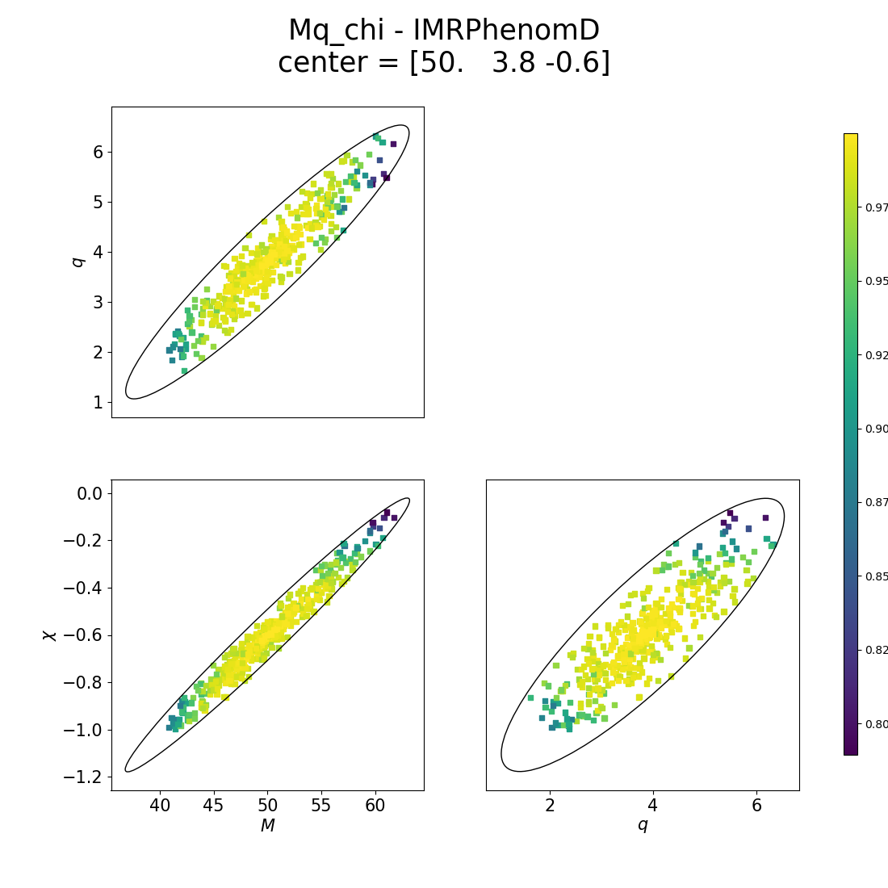
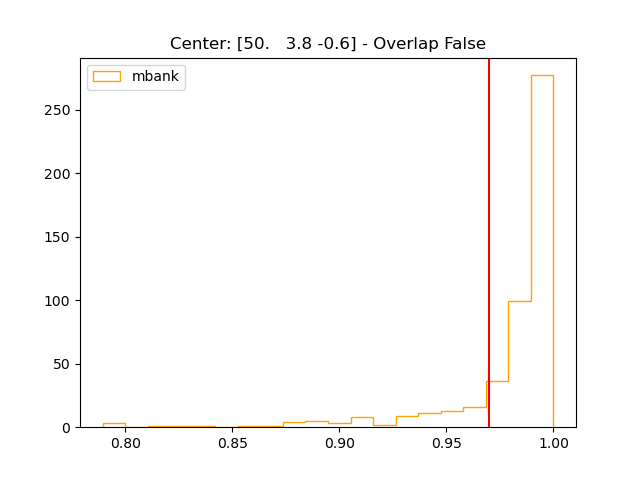
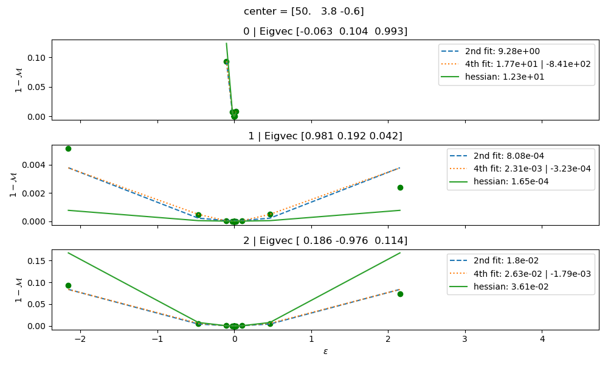
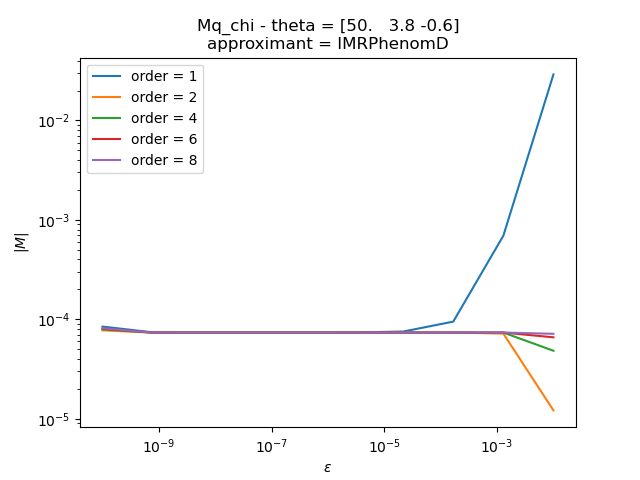
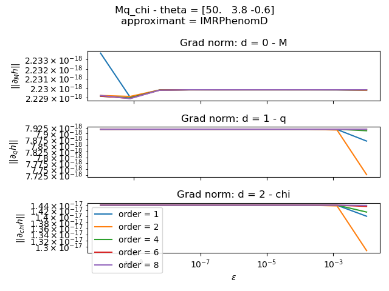

Working with the metric
=======================

The metric is used extensively all around the package, both for bank generation and fitting factor computation.
All the relevant code is gathered in a single class ```mbank.metric.cbc_metric```.

As shown in previous tutorials, to instantiate a metric, the user must specify:

- The variable format: this defines the manifold the metric is defined on and sets the dimensionality of the space (see the help of ```mbank.handlers.variable_handler```
- The power spectral density ([PSD](https://dcc.ligo.org/LIGO-T2000012/public)): it characterizes the properties of the noise and affects the metric components
- The frequency window for the analysis: the minimum and the maximum frequency for the analysis
- The approximant: the name of a frequency domain `lal` approximant to compute the waveforms with

To instantiate the metric for a three dimensional manifold sampling over `M, q, chi`:

```Python
from mbank import cbc_metric
from mbank.utils import load_PSD
f, PSD = load_PSD('aligo_O3actual_H1.txt', True, 'H1')
metric = cbc_metric('Mq_chi',
			PSD = (f,PSD),
			approx = 'IMRPhenomD',
			f_min = 10, f_max = 1024)
```

The object has an internal frequency grid `metric.f_grid`, on which all the waveforms generated are evaluated as well as the PSD (stored in `metric.PSD`). The grid spacing is inferred from the given PSD whereas the limits are given by the frequency window.

To compute the metric at a given point, one can use the function ```get_metric()```. Returning the metric evaluted at a given point ```theta```. The function supports batch evaluation, as custom in `numpy`.
The argument `metric_type` allows the user to decide their preferred metric computation method. We _strongly_ recommend to use the default method `hessian`, which computes the metric as the hessian of the overlap, as stated in the [paper](linktoourpaper): any other metric computation method either provides an experimental feature either shows a poor numerical performance!

A number of helpers allow to compute useful quantities derived from the metric:

- ```get_metric_determinant```: computes the determinant of the metric
- ```get_volume_element```: computes the volume element of the space (the square root of the metric determinant)
- ```log_pdf```: computes the logarithm of the volume element (useful for monte carlo sampling on the manifold)

The object also provides a method ```get_WF``` that returns the waveform evaluated a given value(s) of theta. It iteratively calls the lal function ```SimInspiralChooseFDWaveform``` through the helper method ```get_WF_lal```.

To compute the match between two waveforms (evaluated on the standard frequency grid), the method ```match``` is available.
It can use the [symphony match](https://arxiv.org/abs/1709.09181), extracting a random sky position and polarization.
If the ```overlap``` option is set to True, the time maximization implied by the match is not performed.
The function calls the underlying function ```get_WF_match``` which takes as an input the waveforms (rather than the manifold coordinates).

The following script compares the metric match with the actual match for two close values in the manifold:

```Python
heta1, theta2 = [20, 3, -0.8], [20.1,  3.05, -0.78]
metric.metric_match(theta1, theta2)
metric.match(theta1, theta2)
```

The metric can be computed starting from the gradients of the waveform. To compute the gradients you can call ```get_WF_grads``` which computes the gradients with a finite difference approximation. The user can control the order of the finite difference method as well as the step epsilon.
The gradients will be added on the _last_ dimension of the returned array.

Below you can find an example:

```Python
theta = [[20, 3, -0.8], [10, 4, 0.4]]
WF = metric.get_WF(theta)
WF_grads = metric.get_WF_grads(theta)
```

## Validating the metric

In many cases, it can be interesting to assess the accuracy of the metric as well as the numerical stabilty of its computation.
To ease this operation, we provide an executable `mbank_validate_metric`. The analysis is conduced on a given manifold at a given `center`. As usual, the options can be gathered in an ini file:

```ini
[validation]

variable-format: Mq_chi
center: 50 3.8 -0.6
psd: ./aligo_O3actual_H1.txt
asd: true
ifo: H1
approximant: IMRPhenomD

match: 0.97

f-min: 10
f-max: 1024
N-points: 500
epsilon: 1e-5
order: 4
metric-type: hessian
on-boundaries: false
overlap: false
show: true

save-dir: out_validation
```

Please, refer to `mbank_validate_metric --help` for more information on the arguments.

The command will produce several plots:

- _Constant match ellipses_: given the center, an ellipse of constant match is plotted. A number of points (set by `N_points`) is drawn inside (or, depending on `on-boundaries`, at the boundaries of) the ellipse. The true match of this points with the center is computed and it is reported on the colorbar



- _Match histogram_: the distribution of matches computed for the `N_points` points is plotted on the histogram. A good metric approximation, will show very very few points below the red line, corresponding to the user defined match for the ellipses.



- _True match plot_: for each of the eigendirection of the metric, the relation between match and distance from the center is computed and plotted. In green, it is plotted the same relation as predicted by the metric. The dashed lines report the results of a 2 and 4 dimensional fit.



- _|M| stability_: plot of the relation between the determinant of the metric and the step for the finite difference method, for different orders of the derivative.



- _gradient stability_: plot of the L2 norm of the gradients as a function of the step epsilon for the finite difference method. Again, each series refers to a different order




